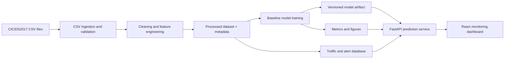

# Network Traffic Anomaly Dashboard

An end-to-end network-security analytics project that turns flow-based CSV records into validated features, anomaly predictions, API data, and an interactive monitoring dashboard.

The project is designed as a portfolio-quality MVP with clear separation between data engineering, machine learning, backend services, persistence, frontend visualization, and deployment. The implemented data pipeline uses CICIDS2017 flow records and produces a reproducible binary-classification dataset for normal-versus-anomalous traffic.

## Why This Project Exists

Network-flow datasets are often large, inconsistent, highly skewed, and difficult to use directly in an application. This project provides a practical path from raw traffic records to security insights:

1. Validate and normalize raw flow CSV files.
2. Clean invalid values and prevent data leakage.
3. Engineer explainable packet, byte, rate, and port features.
4. Train and evaluate a baseline anomaly classifier.
5. Expose traffic, alert, metric, and prediction data through FastAPI.
6. Present operational and model insights in a React dashboard.

The MVP is batch-oriented. It analyzes flow metadata rather than packet payloads and treats model output as decision support, not automated incident response.

## Core Capabilities

| Area | Capability | Availability |
|---|---|---|
| Dataset | CICIDS2017 decision, sampling workflow, schema, limitations, and exploration notebook | Available |
| Ingestion | CSV loading, header normalization, required-column validation, Infinity handling, quality report | Available |
| Preprocessing | Missing/invalid-value handling, raw and feature-level deduplication, label cleaning | Available |
| Feature engineering | Packet, byte, rate, port-category, service flags, one-hot encoding | Available |
| Scaling | Deterministic `log1p` + robust median/IQR scaling with exported parameters | Available |
| Quality assurance | Unit tests, metadata contract, full-output checks for missing/Infinity/duplicates | Available |
| Machine learning | Baseline training, evaluation, saved model, metrics, confusion matrix | Next delivery |
| Backend | Health, traffic, alert, metric, and prediction APIs | Architecture defined |
| Database | Traffic logs, alerts, and model-run persistence | Architecture defined |
| Frontend | Dashboard, traffic logs, alerts, and model-metric views | Architecture defined |
| Deployment | Backend/frontend containers and Docker Compose integration | Architecture defined |

“Architecture defined” means the module boundary and repository location are documented, while executable implementation will be added in the corresponding delivery.

## System Architecture



The pipeline and model run offline. The backend loads approved artifacts and serves persisted traffic records plus predictions to the frontend. This boundary keeps data preparation out of API routes and makes training/inference behavior reproducible.

## Technology Stack

| Layer | Technologies |
|---|---|
| Data pipeline | Python, Pandas, NumPy |
| Machine learning | scikit-learn, joblib |
| Backend | FastAPI, Pydantic, SQLAlchemy, Alembic |
| Database | PostgreSQL; SQLite/mock storage may be used for an early local demo |
| Frontend | React, TypeScript, Vite, Tailwind CSS, Recharts or Chart.js |
| Infrastructure | Docker, Docker Compose, GitHub Actions |
| Documentation and QA | Markdown, Jupyter Notebook, `unittest` |

The frontend is a custom React application rather than Streamlit so the repository demonstrates realistic API/UI boundaries.

## Repository Layout

```text
network-traffic-anomaly-dashboard/
|-- backend/        FastAPI, database, service, and migration boundary
|-- configs/        Shared configuration templates
|-- data/           Raw, external, and generated processed data
|-- docs/           Architecture, dataset, feature, and delivery documentation
|-- frontend/       React and TypeScript dashboard boundary
|-- infra/          Docker and future deployment assets
|-- ml/             Training, evaluation, inference, and experiments
|-- models/         Local/versioned model registry boundary
|-- notebooks/      Exploratory data and model analysis
|-- pipelines/      Executable ingestion and preprocessing pipeline
|-- reports/        Metrics, analysis output, and generated figures
|-- scripts/        Dataset and developer automation scripts
|-- tests/          Cross-module and data-pipeline tests
|-- .env.example    Non-secret environment-variable template
`-- README.md       Project entry point
```

For file-by-file responsibilities, dependency rules, generated artifacts, and extension points, read [docs/low-level-project-structure.md](docs/low-level-project-structure.md).

## Dataset

The primary MVP dataset is [CICIDS2017](https://www.unb.ca/cic/datasets/ids-2017.html). The local sample is built from the `MachineLearningCVE` CSV files and originally contains 50,000 records: 25,000 benign and 25,000 attack records.

The target mapping is:

- `0`: normal traffic (`BENIGN`, `NORMAL`, or source label `0`)
- `1`: anomalous traffic (every other non-empty attack label)

The current MachineLearningCVE export does not include timestamp, source/destination IP, source port, or protocol. The MVP therefore uses destination port, duration, packet count, byte count, rate features, and attack labels. Dashboard views must not claim IP, protocol, or chronological analysis until a richer export is introduced.

Detailed dataset decisions are documented in [docs/dataset.md](docs/dataset.md).

## Processed Data Profile

The verified Day 05 run produces:

| Metric | Result |
|---|---:|
| Raw sample | 50,000 rows × 79 columns |
| Exact raw duplicates removed | 2,945 |
| Duplicate model feature/target rows removed | 1,198 |
| Processed dataset | 45,857 rows × 25 columns |
| Normal records | 23,760 |
| Anomaly records | 22,097 |
| Model input features | 14 |
| Missing cells in final output | 0 |
| Infinite numeric cells in final output | 0 |

Thirty-two identical feature vectors have conflicting binary labels. Both targets are preserved so label ambiguity remains visible rather than being silently discarded.

## Feature Engineering

The pipeline preserves readable operational fields for the future API/dashboard and creates model-ready numeric inputs.

Readable fields include:

- `dst_port`
- `flow_duration_us`
- `total_packets`
- `total_bytes`
- `bytes_per_packet`
- `packets_per_second`
- `bytes_per_second`
- `port_category`
- `attack_type`
- `binary_label`

Model inputs consist of seven scaled numeric features, four service/port flags, and three port-category one-hot columns. Numeric features use `log1p` followed by robust median/IQR scaling. Every imputation and scaling parameter is exported to `preprocessing_metadata.json` for later training and inference.

See [docs/features.md](docs/features.md) for the complete feature and target contract.

## Prerequisites

- Python 3.11 or newer
- `pip`
- Git
- CICIDS2017 MachineLearningCSV files for regenerating the local sample

Backend, frontend, database, and Docker prerequisites will be added alongside their executable modules.

## Quick Start

### 1. Clone and enter the repository

```powershell
git clone https://github.com/duw192/network-traffic-anomaly-dashboard.git
cd network-traffic-anomaly-dashboard
```

### 2. Create a virtual environment

```powershell
python -m venv .venv
.\.venv\Scripts\Activate.ps1
python -m pip install --upgrade pip
python -m pip install -r pipelines/requirements.txt
```

On Linux/macOS, activate with `source .venv/bin/activate`.

### 3. Prepare the local sample

Place the downloaded CICIDS2017 MachineLearningCSV files under:

```text
data/raw/MachineLearningCVE/
```

Create a balanced sample from one or more source files:

```powershell
python scripts/create_dataset_sample.py data/raw/MachineLearningCVE/<file-1>.csv data/raw/MachineLearningCVE/<file-2>.csv --output data/raw/sample.csv
```

The script uses reservoir sampling and keeps up to 25,000 normal plus 25,000 anomalous rows by default.

### 4. Validate and ingest the CSV

```powershell
python pipelines/ingest.py --input data/raw/sample.csv --output data/processed/traffic_ingested.csv
```

This command normalizes headers, verifies the required schema, replaces numeric Infinity values, prints a quality report, and writes a normalized staging CSV.

### 5. Build the processed dataset

```powershell
python pipelines/preprocess.py --input data/raw/sample.csv --output data/processed/traffic_processed.csv --metadata-output data/processed/preprocessing_metadata.json
```

Repository-relative defaults are configured, so `python pipelines/preprocess.py` is sufficient when the sample is at the standard path.

### 6. Run tests

```powershell
python -m unittest discover -s tests -p "test_*.py" -v
```

Expected result: all three pipeline tests pass.

## Pipeline CLI

### Ingestion

```text
python pipelines/ingest.py
  [--input PATH]
  [--output PATH]
  [--max-rows N]
```

### Preprocessing

```text
python pipelines/preprocess.py
  [--input PATH]
  [--output PATH]
  [--metadata-output PATH]
  [--max-rows N]
  [--keep-duplicates]
```

`--max-rows` is useful for smoke tests. `--keep-duplicates` disables exact raw-row removal and should only be used for deliberate diagnostics; model-feature duplicate removal remains part of the safety contract.

## Generated Artifacts

| Artifact | Purpose | Git policy |
|---|---|---|
| `data/raw/sample.csv` | Local balanced source sample | Ignored |
| `data/processed/traffic_ingested.csv` | Header-normalized staging data | Ignored |
| `data/processed/traffic_processed.csv` | Dashboard context plus model-ready features | Ignored |
| `data/processed/preprocessing_metadata.json` | Cleaning statistics, label mapping, feature list, medians, scaling parameters | Ignored |
| `models/registry/*` | Trained model and version metadata | Ignored by default |
| `reports/figures/*` | Generated model/analysis figures | Ignored by default |

Large datasets and generated binaries must not be committed. Scripts and documentation are the reproducible source of truth.

## Configuration

Copy `.env.example` to a local `.env` when backend/database development begins:

```powershell
Copy-Item .env.example .env
```

Documented variables:

| Variable | Purpose |
|---|---|
| `APP_ENV` | Runtime environment name |
| `API_BASE_URL` | Backend URL consumed by local clients/frontend |
| `DATABASE_URL` | SQLAlchemy-compatible database connection |
| `MODEL_REGISTRY_DIR` | Directory containing approved model artifacts |

Never commit `.env` files or credentials.

## Testing and Quality Gates

The pipeline test suite verifies:

- Stable source-header normalization.
- Required-column ingestion and Infinity replacement.
- Raw and feature-level duplicate handling.
- Binary label mapping.
- Web, DNS, and high-port feature generation.
- Finite numeric outputs.
- CSV and metadata JSON creation.

Before using a processed artifact for training, verify that it contains no missing cells, no Infinity values, no duplicate model-feature/target rows, and that `record_id` is sequential. The Day 05 verification record is available in [docs/day-05-control.md](docs/day-05-control.md).

## API and Dashboard Contract

The architecture reserves these backend endpoints:

| Method | Endpoint | Responsibility |
|---|---|---|
| `GET` | `/health` | Service health/readiness |
| `GET` | `/api/traffic` | Paginated/filterable traffic records |
| `GET` | `/api/traffic/{id}` | One traffic record |
| `GET` | `/api/alerts` | Anomaly alerts and severity data |
| `GET` | `/api/metrics` | Dashboard and model metrics |
| `POST` | `/api/predict` | Validate, transform, and classify one flow |

The frontend boundary contains planned pages for Dashboard, Traffic Logs, Alerts, and Model Metrics. API contracts, not frontend components, own business logic and model transformation behavior.

## Delivery Roadmap

1. **Data foundation:** dataset selection, sampling, exploration, ingestion, cleaning, features, scaling, metadata, tests — completed.
2. **ML baseline:** training, evaluation, model artifact, metrics JSON, confusion matrix.
3. **Backend API:** FastAPI structure, schemas, services, prediction integration, health/readiness.
4. **Persistence:** traffic logs, alerts, model runs, migrations, seed data.
5. **Frontend:** dashboard pages, reusable charts, loading/error/empty states.
6. **Integration:** typed API client, CORS, real backend data, end-to-end tests.
7. **Deployment:** Dockerfiles, Docker Compose, configuration, runbook.
8. **Portfolio release:** screenshots, API/model/deployment documents, demo video, final QA.

## Documentation Index

| Document | Purpose |
|---|---|
| [docs/architecture.md](docs/architecture.md) | System boundaries, runtime flow, database/API/frontend design |
| [docs/low-level-project-structure.md](docs/low-level-project-structure.md) | File-level structure, dependency direction, module responsibilities, extension rules |
| [docs/project-plan.md](docs/project-plan.md) | Three-week scope, ownership, milestones, and acceptance criteria |
| [docs/dataset.md](docs/dataset.md) | Dataset choice, sample profile, schema mapping, risks, and sources |
| [docs/day-03-dataset-guide.md](docs/day-03-dataset-guide.md) | Reproducible dataset preparation guide |
| [docs/features.md](docs/features.md) | Cleaning, feature engineering, encoding, scaling, and model contract |
| [docs/day-05-control.md](docs/day-05-control.md) | Day 05 implementation and verification record |
| [notebooks/01_data_exploration.ipynb](notebooks/01_data_exploration.ipynb) | Exploratory dataset analysis |

## Development Rules

- Do not commit directly to `main`; use a task-specific branch and Pull Request.
- Use clear commits such as `feat:`, `fix:`, `docs:`, `test:`, `refactor:`, and `chore:`.
- Keep pipeline, ML, backend, and frontend responsibilities separate.
- Keep training/inference transformations aligned through versioned metadata.
- Add tests with every behavior change.
- Do not commit raw datasets, generated processed data, credentials, or large model binaries.
- Update the relevant contract document when a schema, feature, endpoint, or artifact changes.

## Known Limitations

- The current dataset export has no timestamp, IP, source port, or protocol columns.
- The MVP does not inspect packet payloads or capture live traffic.
- The balanced local sample does not represent production traffic prevalence.
- Random stratified evaluation is suitable for a baseline demonstration but is not proof of cross-network or chronological generalization.
- Model predictions must be interpreted as analyst support, not a production intrusion-prevention decision.

## License and Dataset Attribution

Add a repository license before public distribution. CICIDS2017 remains subject to its publisher's terms and should be cited using the dataset page and paper referenced in [docs/dataset.md](docs/dataset.md). Dataset files are not redistributed by this repository.

