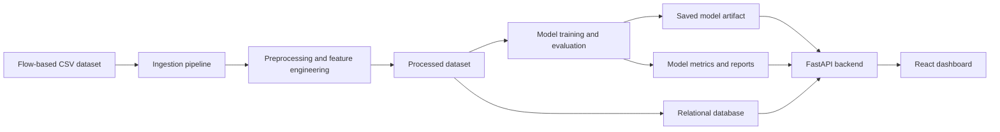
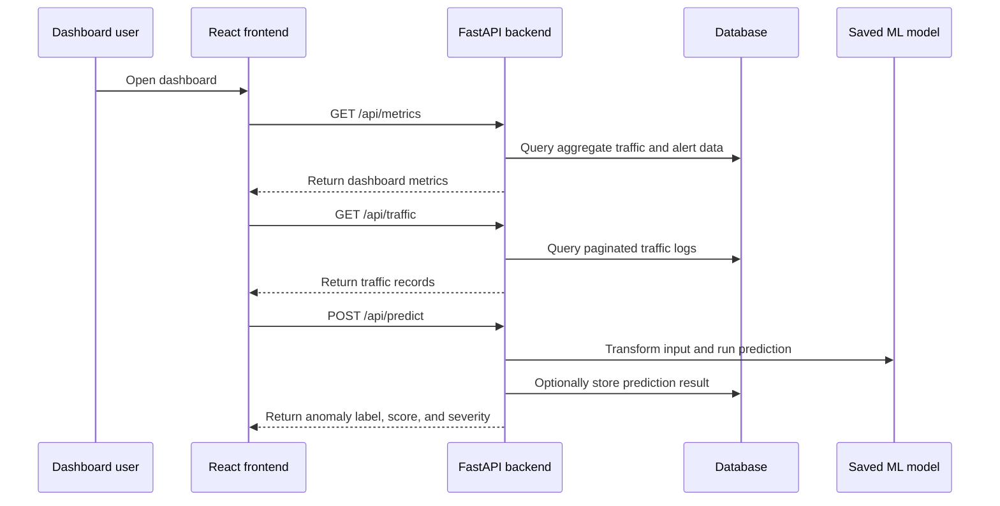
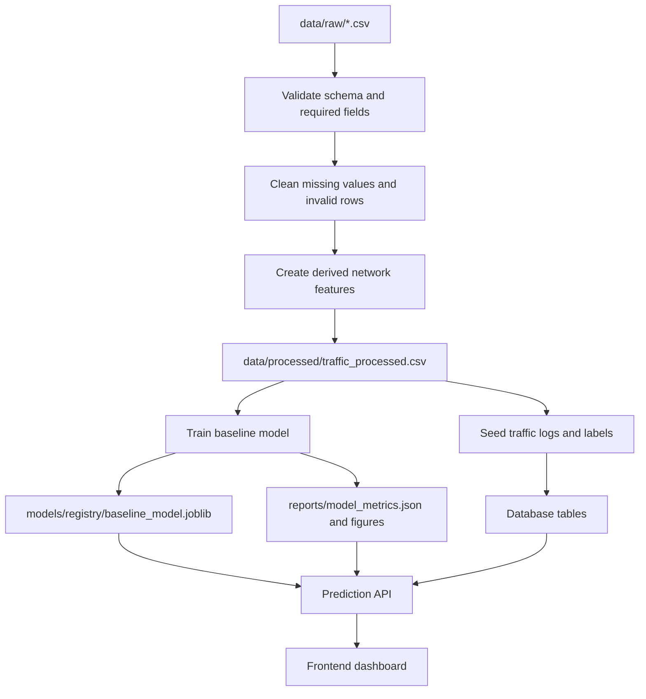
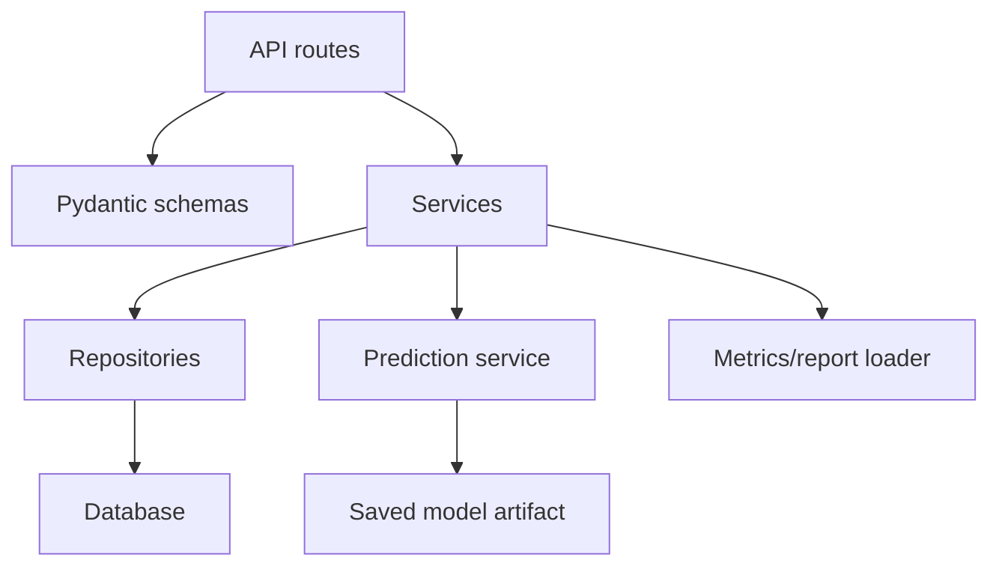
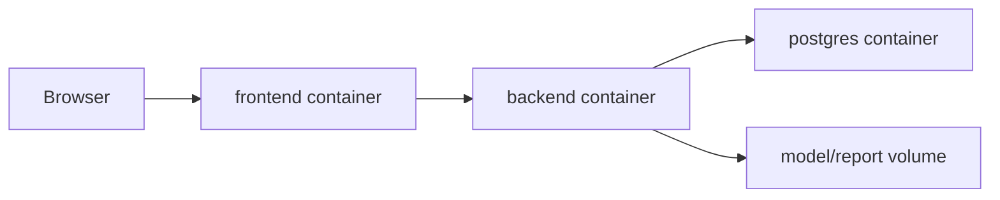

# System Architecture

## 1. Purpose

This document describes the planned architecture for the Network Traffic Anomaly Dashboard.

The project analyzes flow-based network traffic records, detects abnormal behavior with a baseline machine learning model, exposes the results through backend APIs, and presents traffic/security insights in a React dashboard.

The current repository is in the project-structure stage. This architecture defines the target MVP and the boundaries that future implementation should follow.

## 2. Architecture Goals

- Build a complete, explainable MVP suitable for a student portfolio.
- Keep the first version batch-oriented instead of real-time packet capture.
- Separate concerns between data pipelines, machine learning, backend APIs, and frontend UI.
- Use simple, reproducible artifacts: CSV datasets, saved model files, JSON metrics, and database records.
- Make the system runnable locally with Docker Compose.
- Leave room for later upgrades such as streaming ingestion, authentication, and cloud deployment.

## 3. MVP Scope

### In Scope

- Import network traffic records from CSV datasets.
- Clean, validate, and transform raw traffic data.
- Create derived network features for model training.
- Train one baseline anomaly detection model.
- Persist model artifacts and evaluation reports.
- Serve traffic logs, alerts, metrics, and predictions through FastAPI.
- Display dashboard views for overview metrics, traffic logs, alerts, and model performance.
- Run the main services locally through Docker Compose.

### Out of Scope for MVP

- Real-time packet sniffing or live network capture.
- Deep learning models.
- Enterprise authentication and role-based access control.
- Distributed streaming infrastructure.
- Production cloud deployment.
- Automated incident response.

## 4. High-Level Architecture



The MVP uses a batch data flow: data is prepared first, the model is trained offline, and the backend serves persisted records plus inference results. This keeps the system understandable and easier to demonstrate.

## 5. Main Components

| Component | Planned Technology | Responsibility |
|---|---|---|
| Data storage | CSV files | Store raw, external, and processed datasets |
| Data pipeline | Python, Pandas, NumPy | Ingest, validate, clean, and transform traffic data |
| Feature engineering | Python modules | Create model-ready features from raw network flow fields |
| Machine learning | scikit-learn, joblib | Train, evaluate, and save the baseline anomaly model |
| Model registry | Local filesystem | Store versioned model artifacts and metadata |
| Backend API | FastAPI, Pydantic, SQLAlchemy | Serve traffic records, alerts, metrics, and predictions |
| Database | PostgreSQL target, SQLite/mock optional during early MVP | Persist traffic logs, predictions, and alerts |
| Frontend | React, TypeScript, Vite, Tailwind CSS | Provide dashboard pages and data visualizations |
| Visualization | Recharts or Chart.js | Render trends, distributions, metrics, and alert summaries |
| Infrastructure | Docker, Docker Compose | Run frontend, backend, and database together |

## 6. Repository Mapping

The architecture maps to the current repository structure as follows:

```text
network-traffic-anomaly-dashboard/
|-- backend/
|   |-- app/
|   |   |-- api/              API route modules
|   |   |-- core/             settings, logging, shared backend configuration
|   |   |-- db/               database session and migration integration
|   |   |-- models/           SQLAlchemy database models
|   |   |-- repositories/     database access layer
|   |   |-- schemas/          Pydantic request/response schemas
|   |   |-- services/         business logic and prediction service
|   |   `-- workers/          background or batch-triggered backend tasks
|   |-- alembic/              database migrations
|   `-- tests/                backend tests
|-- frontend/
|   |-- public/               static assets
|   |-- src/
|   |   |-- app/              app shell, providers, routing
|   |   |-- assets/           UI assets
|   |   |-- components/       shared UI components
|   |   |-- features/         domain-specific UI modules
|   |   |-- hooks/            reusable React hooks
|   |   |-- lib/              API client and utilities
|   |   |-- pages/            dashboard pages
|   |   `-- styles/           global styles
|   `-- tests/                frontend tests
|-- pipelines/
|   |-- ingestion/            raw CSV loading and validation
|   |-- processing/           cleaning and preprocessing jobs
|   `-- orchestration/        pipeline entrypoints and scheduling helpers
|-- ml/
|   |-- features/             reusable feature transformations
|   |-- training/             training scripts
|   |-- inference/            model loading and prediction helpers
|   |-- evaluation/           evaluation scripts and metric generation
|   `-- experiments/          exploratory model experiments
|-- data/
|   |-- raw/                  original datasets
|   |-- external/             third-party reference data
|   `-- processed/            model-ready datasets
|-- models/
|   `-- registry/             saved models and metadata
|-- reports/
|   `-- figures/              generated charts and evaluation images
|-- infra/
|   |-- docker/               Dockerfiles and container assets
|   |-- k8s/                  future Kubernetes manifests
|   `-- terraform/            future cloud infrastructure
|-- configs/                  shared configuration templates
|-- scripts/                  developer automation scripts
|-- docs/                     project documentation
|-- notebooks/                research notebooks
`-- tests/                    cross-service integration tests
```

## 7. Runtime View



## 8. Data Flow



### Expected Input Fields

The exact dataset columns may vary depending on the selected source, such as CICIDS2017, UNSW-NB15, or a compatible flow dataset. The MVP should normalize the dataset into these logical fields when possible:

| Logical Field | Description |
|---|---|
| `timestamp` | Record or flow timestamp |
| `src_ip` | Source IP address |
| `dst_ip` | Destination IP address |
| `src_port` | Source port |
| `dst_port` | Destination port |
| `protocol` | Network protocol, such as TCP, UDP, or ICMP |
| `duration` | Flow duration |
| `bytes` | Total bytes transferred |
| `packets` | Total packets transferred |
| `label` | Target label, such as normal or anomaly |

### Derived Features

The preprocessing layer should create model-ready features such as:

| Feature | Description |
|---|---|
| `bytes_per_packet` | Average payload size per packet |
| `packets_per_second` | Packet rate based on duration |
| `bytes_per_second` | Throughput-like rate |
| `is_tcp` | Binary protocol indicator |
| `is_udp` | Binary protocol indicator |
| `is_icmp` | Binary protocol indicator |
| `port_category` | Categorized destination port group, such as web, DNS, or other |

## 9. Machine Learning Architecture

The ML layer is offline for the MVP. Training is triggered manually or through a script, and the backend loads the latest approved model artifact.

### Model Selection

| Dataset Condition | Recommended Baseline |
|---|---|
| Labels are available | RandomForestClassifier or LogisticRegression |
| Labels are unavailable | IsolationForest |
| Dataset is highly imbalanced | RandomForestClassifier with class weighting or resampling |

The preferred first baseline is `RandomForestClassifier` when a reliable normal/anomaly label is available because it is strong, explainable enough for a portfolio project, and easy to evaluate.

### ML Outputs

| Output | Target Location | Purpose |
|---|---|---|
| Trained model | `models/registry/` | Loaded by inference code and backend prediction service |
| Feature metadata | `models/registry/` | Keeps training and inference transformations consistent |
| Metrics JSON | `reports/` | Consumed by documentation and backend metrics API |
| Figures | `reports/figures/` | Used for reports, dashboard screenshots, and presentation |

### Evaluation Metrics

The MVP should report:

- Accuracy
- Precision
- Recall
- F1-score
- Confusion matrix
- Anomaly rate in the evaluation dataset

For anomaly detection, recall and false negatives are especially important because missed attacks are usually more costly than extra alerts.

## 10. Backend Architecture

The backend exposes a REST API and coordinates database access, model inference, and dashboard data aggregation.



### Backend Responsibilities

- Provide health and readiness endpoints.
- Validate request payloads with Pydantic schemas.
- Return paginated and filterable traffic logs.
- Return anomaly alerts and severity summaries.
- Return dashboard metrics.
- Load the trained model artifact once and reuse it for predictions.
- Keep feature transformation consistent between training and inference.
- Store prediction and alert records when needed.

### Planned API Endpoints

| Method | Endpoint | Purpose |
|---|---|---|
| `GET` | `/health` | Check service status |
| `GET` | `/api/traffic` | Return traffic log records with pagination/filtering |
| `GET` | `/api/traffic/{id}` | Return one traffic record |
| `GET` | `/api/alerts` | Return anomaly alerts |
| `GET` | `/api/metrics` | Return dashboard and model metrics |
| `POST` | `/api/predict` | Predict anomaly status for one traffic record |

### Example Prediction Request

```json
{
  "timestamp": "2026-01-01T12:00:00Z",
  "src_ip": "192.168.1.10",
  "dst_ip": "10.0.0.5",
  "src_port": 51520,
  "dst_port": 443,
  "protocol": "TCP",
  "duration": 2.4,
  "bytes": 15000,
  "packets": 120
}
```

### Example Prediction Response

```json
{
  "prediction": 1,
  "label": "anomaly",
  "anomaly_score": 0.87,
  "severity": "high",
  "model_version": "baseline-v1"
}
```

## 11. Database Architecture

The target storage layer is relational. PostgreSQL is the preferred final MVP database because it aligns with the planned stack and works well with Docker Compose. SQLite or mock JSON data may be used temporarily during early development, but API contracts should not depend on mock-only behavior.

### Core Tables

#### `traffic_logs`

| Column | Type | Description |
|---|---|---|
| `id` | Integer/UUID | Primary key |
| `timestamp` | DateTime | Record time |
| `src_ip` | String | Source IP address |
| `dst_ip` | String | Destination IP address |
| `src_port` | Integer | Source port |
| `dst_port` | Integer | Destination port |
| `protocol` | String | Network protocol |
| `duration` | Float | Flow duration |
| `bytes` | Integer | Total bytes |
| `packets` | Integer | Total packets |
| `label` | String/Integer | Known label when available |
| `prediction` | String/Integer | Model prediction |
| `anomaly_score` | Float | Model confidence or anomaly score |
| `severity` | String | Low, medium, high, or critical |
| `created_at` | DateTime | Ingestion timestamp |

#### `alerts`

| Column | Type | Description |
|---|---|---|
| `id` | Integer/UUID | Primary key |
| `traffic_log_id` | Integer/UUID | Related traffic record |
| `alert_type` | String | Type of anomaly or rule category |
| `severity` | String | Low, medium, high, or critical |
| `message` | String | Human-readable alert message |
| `created_at` | DateTime | Alert creation time |

#### `model_runs`

| Column | Type | Description |
|---|---|---|
| `id` | Integer/UUID | Primary key |
| `model_version` | String | Version or artifact name |
| `algorithm` | String | Algorithm used for training |
| `dataset_name` | String | Dataset source or file name |
| `accuracy` | Float | Accuracy score |
| `precision` | Float | Precision score |
| `recall` | Float | Recall score |
| `f1_score` | Float | F1 score |
| `artifact_path` | String | Path to saved model |
| `created_at` | DateTime | Training completion time |

## 12. Frontend Architecture

The frontend is a React + TypeScript dashboard that consumes the FastAPI backend.

### Planned Pages

| Page | Purpose |
|---|---|
| Dashboard | Show high-level KPIs, traffic trends, protocol mix, anomaly rate, and recent alerts |
| Traffic Logs | Show filterable and paginated traffic records |
| Alerts | Show anomaly alerts grouped by severity and type |
| Model Metrics | Show model performance metrics and evaluation charts |

### Frontend Responsibilities

- Fetch backend data through a typed API client.
- Render loading, empty, and error states.
- Keep dashboard components reusable and domain-focused.
- Use consistent TypeScript types for traffic records, alerts, metrics, and prediction responses.
- Avoid embedding business logic that belongs in the backend or ML layer.

## 13. Deployment Architecture

The MVP should run locally with Docker Compose.



### Expected Services

| Service | Purpose |
|---|---|
| `frontend` | Serves the React dashboard |
| `backend` | Runs FastAPI and prediction endpoints |
| `database` | Stores traffic logs, alerts, and model run metadata |
| `pipeline` | Optional one-off service for ingestion/preprocessing |

### Configuration

Runtime configuration should come from environment variables, with `.env.example` documenting required values. Secrets and local `.env` files should not be committed.

Expected configuration groups:

- Backend host and port
- Database URL
- CORS allowed origins
- Model artifact path
- Dataset paths
- Log level

## 14. Security and Reliability Considerations

The MVP is not a production security product, but the architecture should still follow safe defaults:

- Validate all API inputs with Pydantic.
- Avoid storing sensitive raw packet payloads.
- Keep dataset paths and model paths configurable.
- Use pagination for traffic log endpoints.
- Add basic request error handling and structured logs.
- Keep model loading failures visible through readiness checks.
- Treat model predictions as decision support, not automatic enforcement.

## 15. Architecture Decisions

| Decision | Reason |
|---|---|
| Use batch CSV ingestion first | Easier to build, test, explain, and demo than real-time capture |
| Use FastAPI for backend | Strong fit for Python ML services and typed API contracts |
| Use React instead of Streamlit | Produces a more realistic portfolio web application |
| Use scikit-learn baseline | Fast to train and easier to evaluate for an MVP |
| Keep feature engineering outside the backend | Prevents training/inference logic from being duplicated in API routes |
| Store model artifacts locally | Simple for local development and Docker Compose demos |
| Target PostgreSQL for final MVP | More professional than file-only storage and compatible with future deployment |
| Keep cloud/Kubernetes as future work | Avoids infrastructure complexity before core product behavior exists |

## 16. Development Order

1. Confirm dataset choice and document the expected schema.
2. Implement ingestion and preprocessing pipelines.
3. Generate processed dataset and feature metadata.
4. Train and evaluate the baseline model.
5. Save model artifacts, metrics, and figures.
6. Implement backend database models and migrations.
7. Implement backend traffic, alert, metrics, and prediction endpoints.
8. Build dashboard pages and typed API client.
9. Connect frontend to backend and verify end-to-end data flow.
10. Add Docker Compose, environment examples, and final demo documentation.

## 17. Future Evolution

After the MVP works end to end, the system can evolve in these directions:

- Replace batch ingestion with scheduled or streaming ingestion.
- Add authentication and role-based access.
- Add model version selection and rollback support.
- Add drift monitoring for traffic patterns and model performance.
- Add richer alert triage workflows.
- Deploy to a cloud provider with managed database storage.
- Add CI checks for backend, frontend, pipelines, and documentation.
