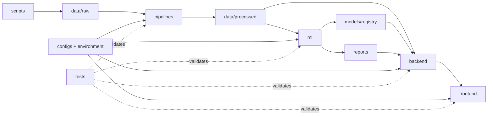

# Low-Level Project Structure

## 1. Purpose

This document is the file-level implementation map for the Network Traffic Anomaly Dashboard. It explains what every repository area owns, which parts are executable, which folders are reserved extension points, how artifacts move between modules, and which dependencies are allowed.

Use this document when adding files or deciding where new logic belongs. Use `docs/architecture.md` for system-level design and `docs/features.md` for the data/model feature contract.

## 2. Structure Legend

| Marker | Meaning |
|---|---|
| `[implemented]` | Contains executable or completed project content |
| `[contract]` | Directory boundary exists and its responsibility is defined; implementation is added in a later delivery |
| `[generated]` | Produced by a command; not edited manually |
| `[local]` | Exists on a developer machine and is ignored by Git |
| `[tracked]` | Source-of-truth file intended for version control |

An empty `.gitkeep` is not implementation. It only preserves an intentional directory in Git.

## 3. Dependency Direction

Dependencies must flow from delivery/interface layers toward stable domain and artifact contracts:



Mandatory rules:

- `pipelines` must not import backend or frontend code.
- `ml` may read processed artifacts and shared feature metadata; it must not call API routes.
- `backend` may load approved model/report artifacts and call ML inference utilities; it must not retrain models during an HTTP request.
- `frontend` communicates through backend API contracts only; it must not read CSV/model files directly.
- `scripts` orchestrate developer tasks but must not contain business logic that belongs in pipeline, ML, or backend modules.
- `notebooks` may import production functions for analysis; production code must never import notebooks.
- Generated data, models, caches, and figures are outputs, never source dependencies committed as hidden logic.

## 4. Root-Level Files

```text
network-traffic-anomaly-dashboard/
|-- .env.example
|-- .gitignore
|-- README.md
`-- ke_hoach_3_tuan_network_anomaly_dashboard.docx  [local planning source]
```

### `.env.example` `[tracked]`

Non-secret configuration template. It currently documents:

- `APP_ENV`: environment name.
- `API_BASE_URL`: local backend base URL.
- `DATABASE_URL`: PostgreSQL/SQLAlchemy connection string.
- `MODEL_REGISTRY_DIR`: location of approved model artifacts.

When a new environment variable becomes required, add it here with a safe example and document it in the owning module. Never place real credentials in this file.

### `.gitignore` `[tracked]`

Prevents environment files, virtual environments, Python/Node caches, local datasets, processed artifacts, model binaries, and generated report figures from entering version control. Keep `.gitkeep` exceptions so empty architectural directories remain visible.

### `README.md` `[tracked]`

Project entry point for recruiters, contributors, and reviewers. It owns the product summary, capabilities, quick start, architecture overview, verified data profile, commands, roadmap, and documentation index. Detailed technical contracts belong under `docs/`, not in duplicated README sections.

### Planning DOCX `[local]`

The three-week planning document is input/reference material, not runtime code. The actionable repository sources of truth are the Markdown plan, architecture, feature, and delivery-control documents.

## 5. `.github/`

```text
.github/
`-- workflows/
    `-- .gitkeep
```

`workflows/` `[contract]` owns CI automation. Expected future workflows:

- Python syntax/unit tests for pipelines, ML, and backend.
- Frontend type-check, lint, and unit tests.
- Docker build verification.
- Optional documentation link/style checks.

Workflows may run validation and builds but must not embed project logic.

## 6. `pipelines/` - Data Engineering Boundary

```text
pipelines/
|-- __init__.py
|-- ingest.py
|-- preprocess.py
|-- requirements.txt
|-- README.md
|-- ingestion/
|   `-- .gitkeep
|-- processing/
|   `-- .gitkeep
`-- orchestration/
    `-- .gitkeep
```

### `pipelines/__init__.py` `[implemented]`

Marks `pipelines` as an importable Python package. Keep it lightweight; do not execute I/O during package import.

### `pipelines/requirements.txt` `[implemented]`

Minimal runtime dependency contract for Day 05:

- NumPy for finite-value checks and numeric operations.
- Pandas for CSV loading, cleaning, feature engineering, and output.

Model libraries belong in an ML-level requirements file or a consolidated dependency strategy when Day 07 is implemented.

### `pipelines/ingest.py` `[implemented]`

Owns source-file loading and schema validation.

| Symbol | Responsibility |
|---|---|
| `DEFAULT_INPUT_PATH` | Standard raw sample path |
| `DEFAULT_OUTPUT_PATH` | Standard normalized staging path |
| `REQUIRED_COLUMNS` | Minimum normalized source schema |
| `IngestionReport` | Serializable quality summary |
| `normalize_column_name()` | Convert BOM/space/punctuation headers to stable `snake_case` |
| `normalize_columns()` | Normalize all headers and reject post-normalization collisions |
| `validate_required_columns()` | Fail early when source fields are absent |
| `load_csv()` | Read CSV, validate non-empty input, replace numeric Infinity, return data + report |
| `write_csv()` | Create parent directory and write normalized staging CSV |
| `parse_args()` | Define CLI flags |
| `main()` | Standalone ingestion command entry point |

Input contract: CICIDS2017-style CSV containing the seven required normalized fields.

Output contract: a header-normalized DataFrame/CSV plus an `IngestionReport`. Ingestion does not engineer model features or map targets.

### `pipelines/preprocess.py` `[implemented]`

Owns cleaning, feature engineering, target mapping, encoded features, deduplication, scaling, and metadata export.

| Symbol | Responsibility |
|---|---|
| `NORMAL_LABELS` | Case-insensitive values mapped to class `0` |
| `WEB_PORTS`, `DNS_PORTS` | Explainable service-port sets |
| `SOURCE_NUMERIC_COLUMNS` | Required numeric source fields |
| `MODEL_BASE_COLUMNS` | Seven readable values transformed into scaled features |
| `_clean_label()` | Trim labels and repair known damaged dash encodings |
| `_port_category()` | Map ports to well-known, registered, dynamic/private ranges |
| `_safe_rate()` | Divide only by positive denominators; never produce Infinity |
| `_impute_median()` | Fill missing numeric values and record medians |
| `_log_robust_scale()` | Apply `log1p`, median centering, and IQR scaling |
| `preprocess_frame()` | Execute the in-memory transformation contract |
| `write_outputs()` | Write processed CSV and reproducibility metadata JSON |
| `parse_args()` | Define input/output/smoke/duplicate CLI controls |
| `main()` | End-to-end preprocessing command entry point |

Preprocessing order is significant:

1. Copy input and optionally remove exact raw duplicates.
2. Clean labels and remove rows without a usable target.
3. Coerce required numeric fields.
4. Reject invalid port/range values into missing values.
5. Median-impute required numeric values.
6. Create readable totals and rates.
7. Median-impute undefined zero-denominator rates.
8. Create port categories, flags, and one-hot columns.
9. Map the binary label.
10. Detect conflicting feature vectors.
11. Remove duplicate feature-vector/target rows.
12. Add sequential `record_id`.
13. Create scaled model features.
14. Reorder columns and emit metadata.

Changing this order is a contract change and requires updated tests, metadata version, `docs/features.md`, and Day 07 inference compatibility.

### Reserved pipeline subdirectories `[contract]`

- `ingestion/`: split source-specific readers here when more datasets or stream/file formats are introduced.
- `processing/`: reusable transformers when `preprocess.py` becomes too large.
- `orchestration/`: scheduled/batch entry points that coordinate ingestion and processing without duplicating transformations.

Do not move code into these folders merely to fill them. Split only when responsibility or reuse justifies a module.

## 7. `data/` - Local Artifact Boundary

```text
data/
|-- README.md
|-- raw/
|   |-- .gitkeep
|   |-- sample.csv                              [local]
|   `-- MachineLearningCVE/*.csv                [local]
|-- external/
|   `-- .gitkeep
`-- processed/
    |-- .gitkeep
    |-- traffic_ingested.csv                    [generated/local]
    |-- traffic_processed.csv                   [generated/local]
    `-- preprocessing_metadata.json             [generated/local]
```

### `data/raw/`

Immutable or minimally sampled source data. Do not manually clean files in place. Rebuild `sample.csv` with the sampling script so the process remains reproducible.

### `data/external/`

Third-party lookup/reference data that is not the primary traffic dataset, for example a future port/service registry snapshot. Document source, version, license, and checksum before use.

### `data/processed/`

Pipeline-generated artifacts. Files here can be deleted and regenerated from tracked scripts plus local raw inputs. Application code should depend on the documented schema, not undocumented column positions.

## 8. Processed Dataset Schema

`traffic_processed.csv` contains exactly 25 ordered columns.

### Identity and readable network context

| Column | Meaning |
|---|---|
| `record_id` | Sequential artifact-local row ID; never a model feature |
| `dst_port` | Destination port |
| `flow_duration_us` | Flow duration in microseconds |
| `total_packets` | Forward + backward packets |
| `total_bytes` | Forward + backward packet lengths |
| `bytes_per_packet` | Average bytes per packet |
| `packets_per_second` | Packet rate |
| `bytes_per_second` | Byte rate |
| `port_category` | Readable port range category |

### Encoded categorical/service features

| Column | Meaning |
|---|---|
| `is_well_known_port` | Port `0..1023` |
| `is_web_port` | Known web/application web port flag |
| `is_dns_port` | DNS port `53` flag |
| `is_high_port` | Dynamic/private port range flag |
| `port_category_well_known` | One-hot category |
| `port_category_registered` | One-hot category |
| `port_category_dynamic_private` | One-hot category |

### Scaled numeric model features

- `feature_dst_port_scaled`
- `feature_flow_duration_us_scaled`
- `feature_total_packets_scaled`
- `feature_total_bytes_scaled`
- `feature_bytes_per_packet_scaled`
- `feature_packets_per_second_scaled`
- `feature_bytes_per_second_scaled`

### Audit and target fields

| Column | Meaning |
|---|---|
| `attack_type` | Cleaned original source label for audit/reporting |
| `binary_label` | Model target: `0 = normal`, `1 = anomaly` |

## 9. Metadata JSON Schema

`preprocessing_metadata.json` is the transformation contract between Day 05 preprocessing and Day 07 training/inference.

| Top-level key | Contents |
|---|---|
| `pipeline_version` | Transformation contract version |
| `input` | Ingestion path, dimensions, duplicates, missing/Infinity counts, required columns |
| `cleaning` | Before/after rows, both deduplication counts, conflicting vectors, invalid values, medians |
| `label_mapping` | Normal label values and binary class meanings |
| `output_columns` | Ordered processed CSV schema |
| `model_feature_columns` | Exact ordered model input contract |
| `target_column` | `binary_label` |
| `scaling_parameters` | Source, transform, log median, and log IQR for every scaled feature |
| `class_distribution` | Binary output distribution |
| `attack_type_distribution` | Cleaned source-label distribution |

Training must read `model_feature_columns` instead of selecting every numeric CSV column. Inference must reuse the saved median/scaling parameters and must not refit them per request.

## 10. `scripts/` - Developer Automation

```text
scripts/
|-- README.md
`-- create_dataset_sample.py
```

### `create_dataset_sample.py` `[implemented]`

Creates a bounded, reproducible CICIDS2017 sample without loading all source files into memory.

Key responsibilities:

- Normalize source headers.
- Locate the configured label column case-insensitively.
- Map source labels into normal/anomaly sampling buckets.
- Use reservoir sampling with a fixed seed.
- Keep up to `--per-class` records per binary class.
- Shuffle and write the sample.
- Print the original attack-label distribution.

This script prepares local raw input. It does not clean features or generate model-ready data.

## 11. `notebooks/` - Research Boundary

```text
notebooks/
|-- README.md
`-- 01_data_exploration.ipynb
```

`01_data_exploration.ipynb` `[implemented]` is used to inspect shape, columns, labels, missing values, duplicates, ranges, and feature candidates. A notebook records reasoning and visualization; it is not a production pipeline. Any transformation needed by training or inference must be implemented in importable Python modules and covered by tests.

## 12. `ml/` - Machine Learning Boundary

```text
ml/
|-- README.md
|-- features/
|-- training/
|-- inference/
|-- evaluation/
`-- experiments/
```

All subdirectories are currently `[contract]` boundaries:

- `features/`: reusable transformation/loading adapters that consume Day 05 metadata; no duplicate feature formulas.
- `training/`: dataset split, baseline construction, fitting, versioning, and artifact persistence.
- `inference/`: approved model loading and deterministic single/batch prediction.
- `evaluation/`: accuracy, precision, recall, F1, confusion matrix, threshold/error analysis.
- `experiments/`: optional research configurations and notes; not imported by production paths.

Expected Day 07 entry points may be `ml/train.py` and `ml/evaluate.py` at the boundary or thin wrappers over these packages. The final location must be reflected in README and tests.

## 13. `models/` - Model Registry Boundary

```text
models/
|-- README.md
`-- registry/
    `-- .gitkeep
```

`models/registry/` `[contract/local]` will contain versioned model binaries and companion metadata. A model version must include:

- Algorithm and hyperparameters.
- Training dataset/profile identifier.
- Ordered feature list.
- Preprocessing contract version.
- Evaluation metrics.
- Creation timestamp and code revision when available.

Large binaries remain ignored unless the team deliberately adopts Git LFS or external artifact storage.

## 14. `reports/` - Evaluation Output

```text
reports/
|-- README.md
`-- figures/
    `-- .gitkeep
```

Expected generated outputs:

- `model_metrics.json`: machine-readable evaluation metrics.
- `figures/confusion_matrix.png`: baseline classification errors.
- Optional feature-importance, distribution, or threshold figures.

Reports are outputs of evaluation. Backend code may read approved JSON metrics, but it must not parse notebook output.

## 15. `backend/` - API and Persistence Boundary

```text
backend/
|-- README.md
|-- app/
|   |-- api/
|   |   `-- v1/
|   |-- core/
|   |-- db/
|   |-- models/
|   |-- repositories/
|   |-- schemas/
|   |-- services/
|   `-- workers/
|-- alembic/
|   `-- versions/
`-- tests/
```

These are `[contract]` boundaries with the following low-level responsibilities:

- `app/main.py`: application factory/startup, router registration, middleware, lifecycle.
- `app/api/v1/`: HTTP route handlers only; validate input, call services, serialize output.
- `app/core/`: settings, logging, application exceptions, security/common runtime utilities.
- `app/db/`: engine, sessions, base model, transaction/session dependencies.
- `app/models/`: SQLAlchemy persistence entities such as traffic logs, alerts, model runs.
- `app/repositories/`: database queries and persistence operations; no HTTP knowledge.
- `app/schemas/`: Pydantic request/response contracts; no database queries.
- `app/services/`: use cases such as prediction, alert creation, metrics aggregation.
- `app/workers/`: background/import jobs that are inappropriate for request latency.
- `alembic/versions/`: immutable database migration history.
- `backend/tests/`: route, service, repository, and database tests.

Allowed call direction:

```text
route -> schema + service -> repository/inference -> database/model artifact
```

Routes must not contain Pandas preprocessing logic, SQL strings, model training, or frontend formatting.

## 16. `frontend/` - Presentation Boundary

```text
frontend/
|-- README.md
|-- public/
|-- src/
|   |-- app/
|   |-- assets/
|   |-- components/
|   |-- features/
|   |   |-- anomalies/
|   |   `-- traffic/
|   |-- hooks/
|   |-- lib/
|   |   `-- api/
|   |-- pages/
|   `-- styles/
`-- tests/
```

These are `[contract]` boundaries:

- `public/`: files copied as-is by the frontend build.
- `src/app/`: application shell, router, providers, layout, global error boundary.
- `src/assets/`: imported images/icons/fonts owned by the app.
- `src/components/`: domain-neutral reusable UI such as cards, tables, status badges, chart containers.
- `src/features/anomalies/`: alert/anomaly domain components, hooks, types, presentation adapters.
- `src/features/traffic/`: traffic log/domain components, filters, tables, visualization adapters.
- `src/hooks/`: generic reusable React hooks only.
- `src/lib/api/`: HTTP client, endpoint functions, API error normalization.
- `src/pages/`: route-level composition for Dashboard, Traffic Logs, Alerts, Model Metrics.
- `src/styles/`: global tokens, Tailwind entry styles, theme utilities.
- `tests/`: component, hook, API-client, and page tests.

Components must not infer anomaly labels, reproduce feature scaling, or query the database. They render typed API results.

## 17. `configs/` - Shared Configuration Templates

```text
configs/
|-- .gitkeep
`-- README.md
```

`configs/` `[contract]` is reserved for non-secret, environment-independent configuration such as a future model-training YAML or logging template. Runtime secrets remain environment variables. Code defaults should be safe for local development and explicit in one owning settings module.

Do not create multiple conflicting sources for the same setting across `.env`, YAML, Python constants, and frontend files.

## 18. `infra/` - Deployment Boundary

```text
infra/
|-- README.md
|-- docker/
|-- k8s/
`-- terraform/
```

- `docker/` `[contract]`: backend/frontend Dockerfiles and container helper assets.
- `k8s/` `[contract]`: optional Kubernetes manifests only if deployment scope expands.
- `terraform/` `[contract]`: optional infrastructure-as-code for cloud resources.

The repository root may later contain `docker-compose.yml` because it composes multiple top-level services. Infrastructure files configure/build services; they must not fork application logic.

## 19. `tests/` - Cross-Module Quality Boundary

```text
tests/
|-- README.md
|-- test_data_pipeline.py
`-- integration/
    `-- .gitkeep
```

### `test_data_pipeline.py` `[implemented]`

Uses standard-library `unittest`, temporary directories, and small in-memory fixtures. It verifies:

- Header normalization including `.1` suffix handling.
- CSV load and required schema.
- Infinity replacement.
- Raw duplicate removal.
- Feature-level duplicate removal.
- Finite processed numeric values.
- Web/DNS/high-port flags.
- Binary target distribution.
- CSV and metadata JSON creation.

### `tests/integration/` `[contract]`

Reserved for cross-boundary tests such as processed artifact -> training, backend -> database/model, and frontend -> live/mock API. Unit tests should remain close to their owning backend/frontend module where appropriate.

## 20. `docs/` - Technical Source of Truth

```text
docs/
|-- README.md
|-- architecture.md
|-- low-level-project-structure.md
|-- project-plan.md
|-- dataset.md
|-- day-03-dataset-guide.md
|-- features.md
`-- day-05-control.md
```

| File | Owns |
|---|---|
| `README.md` | Documentation index |
| `architecture.md` | High-level components, flows, runtime, API/database/frontend design |
| `low-level-project-structure.md` | File responsibilities, allowed dependencies, schema/artifact ownership |
| `project-plan.md` | Delivery sequence, ownership, acceptance criteria |
| `dataset.md` | Dataset selection, mapping, sample profile, risks, citations |
| `day-03-dataset-guide.md` | Reproducible Day 03 procedure |
| `features.md` | Cleaning, encoding, feature, scaling, and target contract |
| `day-05-control.md` | Implemented Day 05 work and verification evidence |

When documentation conflicts, the narrower contract wins for its domain: feature transformations come from `features.md` and generated metadata; module placement comes from this file; system intent comes from `architecture.md`.

## 21. Naming and File Placement Rules

### Python

- Modules/functions/variables: `snake_case`.
- Classes/dataclasses: `PascalCase`.
- Constants: `UPPER_SNAKE_CASE`.
- CLI scripts must expose `parse_args()` and `main()` and protect execution with `if __name__ == "__main__"`.
- Importable modules must not perform file I/O at import time.

### TypeScript/React

- React components/pages: `PascalCase.tsx`.
- Hooks: `useSomething.ts`.
- Non-component utilities/API modules: `camelCase.ts` or the team-selected consistent convention.
- Domain code belongs under `features/`; generic UI belongs under `components/`.

### Documents and artifacts

- Markdown: lowercase kebab-case for topic documents.
- Generated data/model/report names should be stable and versioned when consumed across deliveries.
- Never encode a local absolute path into committed source or metadata intended for other machines.

## 22. Change Checklist

### Adding a source dataset

1. Add a source-specific reader/adapter under `pipelines/ingestion/` if schema differs materially.
2. Preserve a normalized logical schema before preprocessing.
3. Add fixtures and schema tests.
4. Update `docs/dataset.md` and `docs/features.md`.
5. Increment the pipeline contract version if outputs change.

### Adding or changing a model feature

1. Implement it once in the pipeline/shared transformation layer.
2. Add validation and unit tests, including zero/missing/extreme values.
3. Add it to metadata `model_feature_columns` in intentional order.
4. Update scaling metadata and `docs/features.md`.
5. Retrain/evaluate the model and version the new artifact.
6. Update inference before deploying the model.

### Adding an API endpoint

1. Define request/response schemas.
2. Implement service behavior.
3. Add repository/inference dependencies behind the service.
4. Add a thin route handler under `api/v1/`.
5. Add unit/integration tests.
6. Document the endpoint and update the typed frontend client.

### Adding a dashboard view

1. Define/extend API response types.
2. Add endpoint access in `src/lib/api/`.
3. Place domain logic/components under the appropriate `features/` folder.
4. Compose the route under `pages/`.
5. Implement loading, error, empty, and success states.
6. Add component/page tests.

## 23. Definition of Structural Correctness

The repository structure is correct when:

- Every behavior has one clear owning module.
- Dependency direction follows the documented flow.
- Generated artifacts can be recreated from tracked code and documented local inputs.
- Training and inference use the same ordered feature/transformation metadata.
- API routes remain thin and frontend code remains presentation-focused.
- Empty contract directories are not described as completed implementations.
- Tests cover behavior at the narrowest useful boundary and integration tests cover cross-boundary contracts.
- README and technical documents are updated whenever public commands, schemas, features, endpoints, or artifact paths change.

